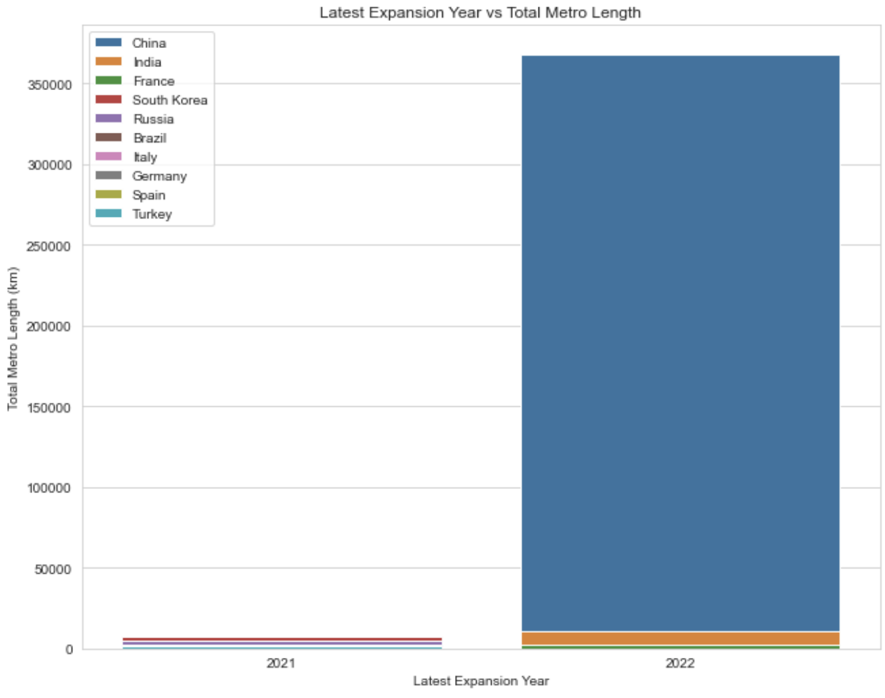
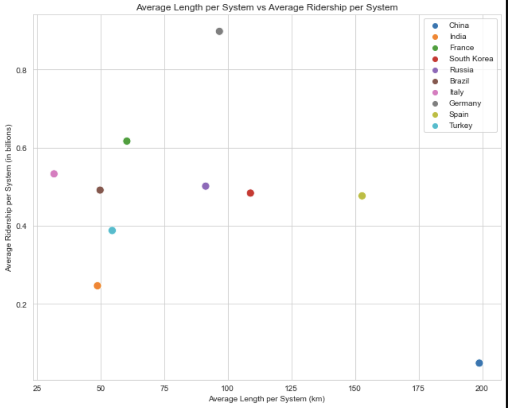

# Metro Systems Analysis   😇

Analyze and visualize metro systems data from various countries, focusing on their recent developments, total lengths, and other key metrics.


---

## 📌 Table of Contents

- [Overview](#overview)
- [Datasets](#datasets)
- [Quick Start](#quick-start)
- [Analysis Insights](#analysis-insights)
- [Visualizations](#visualizations)
- [License](#license)

---

## 🎯 Overview

This project aggregates data from multiple sources to derive insights about metro systems across different countries. We focus on aspects such as the latest expansions, total lengths, and key metrics of metro systems. The results are presented both in tabular form and through compelling visualizations.

---

## 🗌 Datasets

We leverage two primary datasets:

1. **🗳 Countries with existing metro systems**:
    - Details about cities with metro systems, including year of inauguration, last expansion, and annual ridership.
2. **🌏 Countries with total metro systems data**:
    - Aggregate data about metro systems in various countries, encompassing details like total length, number of lines, and total stations.

---

## 🚀 Quick Start

1. Navigate to the project directory and install the required libraries:
   ```bash
   pip install pandas seaborn matplotlib sqlite3
   ```
2. Run the `main.py` script (which contains the provided code):
   ```bash
   python main.py
   ```

---

## 📊 Analysis Insights

- **🔄 Latest Expansions**: Identify countries that have recently expanded their metro systems.
- **🌍 Metro Lengths**: Compare the total lengths of metro systems across various countries.
- **📈 Ridership Analysis**: Evaluate the average ridership per metro system for each country.
- **🔍 Summary of Insights**:

China stands out as the country with the most recent metro expansion in 2022. It also has the highest total metro length (367,633.66 km) and the most stations (231,125). When averaged per system, China has about 199 km of metro lines.

India and France also had their latest expansions in 2022. While India has significantly more total metro length (10,976.25 km) compared to France (2,172 km), the average length per system in France (60.33 km) is greater than that of India (48.78 km).

South Korea, Russia, Brazil, Italy, Germany, Spain, and Turkey had their latest expansions in 2021. Among these, South Korea has the highest total metro length (6,969.60 km).

When considering the average length per metro system, Spain leads with approximately 153 km, followed closely by South Korea and Germany with approximately 109 km and 97 km, respectively.

In terms of average ridership per system, Germany tops the list with approximately 0.8975 billion riders, followed by Italy and India.

---

## 🎨 Visualizations

The project offers multi-faceted visualizations:

1. **📊 Bar Chart**: Displays the latest year of metro expansion against the total metro length for the top 10 countries.
   
   
2. **🔹 Scatter Plot**: Showcases the relationship between the average length per metro system and the average ridership per system.
   

---

